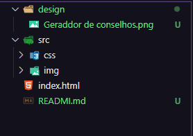

# Intrudução
Este projeto foi criado para ilustrar o layout de um site gerador de conselhos, assim que o usuário clicar no dado a baixo do conselho ele gera um novo.

# Layout

# Arquivos

# Tecnologias 

As tecnologias usadas foram apenas o CSS e o HTML.

# HTML

Neste arquivo foi criado o corpo do site, foi usado tag's e div's com classes especificas para cada elemento criado para separarmos e facilitar ao estilizar o site.

# CSS

Aqui atentamos para a estilização do site, deixando ele mais apresentavél ao usuário, e foi criado também o arquivo para resertar as dimessões do site tendo em vista que a pagina já vem com algumas pré selecionadas.

